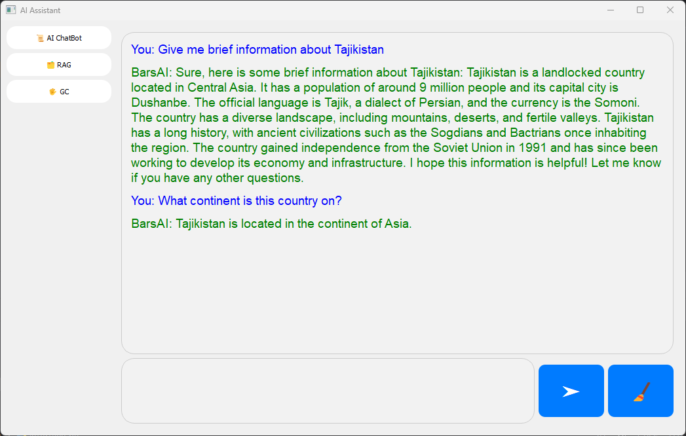
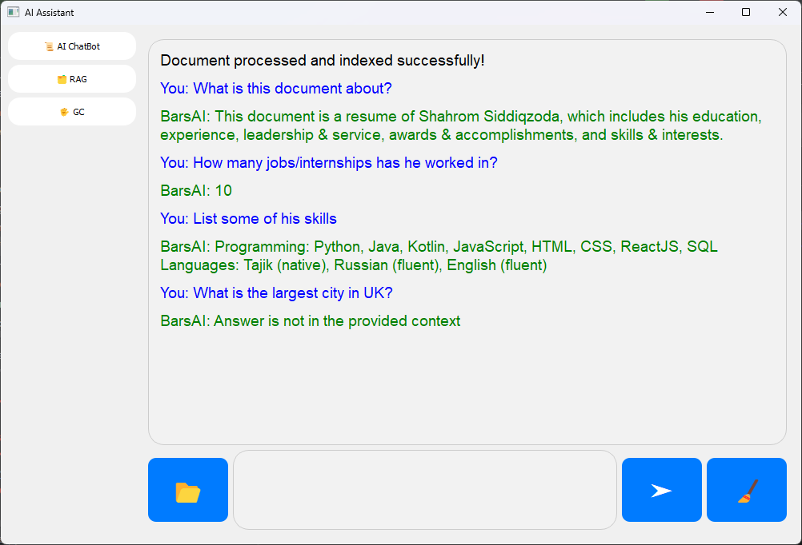

  

<h1 align="center">
  BarsAI 🤖
</h1>

   
  <a href="https://ucentralasia.org/home"><code>University of Central Asia</code> 🎓</a>

<h3>📝 Project Overview</h3>

 As my final year project for my Bachelor of Science in Computer Science at the <a href="https://ucentralasia.org/home">University of Central Asia</a>, I developed BarsAI—a desktop application aimed at making human-computer interaction more natural and intuitive. 
BarsAI enables intelligent conversations, document processing, and gesture control, bringing together cutting-edge AI technologies like conversational AI, Retrieval-Augmented Generation (RAG), and gesture recognition in a single, easy-to-use application. 
It runs locally using a GGUF-quantized version of the Llama 2 7B Chat model, allowing the chatbot to function entirely offline. For document-based queries, BarsAI taps into the power of Google’s Gemini Pro model, which requires an internet connection to process and retrieve relevant information. 
This project reflects my passion for AI and my desire to create a tool that blends intelligence with convenience. 

<h3>⚡ Features</h3>

  🤖 <strong>Conversational AI</strong> -  Built with the Llama-2-7B-Chat-GGUF model, the assistant can engage in intelligent and context-aware conversations.                                    
  📄 <strong>Document Query Processing</strong> - Powered by Google AI’s Gemini Pro model, the assistant can process and respond to queries based on uploaded documents (PDF, DOCX, CSV, Excel).  
  ✋ <strong>Gesture Control</strong> -  Users can control their computers using hand gestures.                                                                                                   
  📡 <strong>Offline Functionality</strong> - The AI Assistant can operate partially offline, ensuring accessibility even without an internet connection.                                         
  💻 <strong>User-Friendly Interface</strong> - Developed using PyQt5, the interface is designed for simplicity and ease of use.                                                                  

<h3>🧩 Project Structure </h3>

<table>
<tr>
<th colspan="2">
<h3>Chatbot Module</h3>
</th>
</tr>
<tr>
<td align="center">

The Chatbot Module of the application handles user interactions and provides responses based on the Llama-2-7B-Chat-GGUF model. It also has a history of previous requests, so it understands the context as shown in the screenshot (the country is not specified in the second request). 

</td>
</tr>

<tr>
<th colspan="2">
<h3>RAG Module</h3>
</th>
</tr>
<tr>
<td align="center">

Retrieval-Augmented Generation or Document Processing Module manages document queries and generates relevant responses using the Gemini Pro model. When users upload a document, the model processes and indexes the document. 
After that, the user can ask questions from the contents of the document. If they ask something irrelevant, a message will be displayed saying that it does not relate to the context of the document. 

</td>
</tr>

<tr>
<th colspan="2">
<h3>Gesture Control</h3>
</th>
</tr>
<tr>
<td align="center">

 The Gesture Control Module allows users to interact with their system using gestures. 

 Swipe to the right gesture activates forward action, and swipe to the left gesture triggers backwards action. 

 

 Volume control gesture adjusts the volume of the computer if the distance between the thumb and index fingers changes. 

</td>
</tr>
</table>

<h3> 📥 Installation and Setup</h3>

<h4>Prerequisites</h4>
<ul>
  <li>Python 3.10 or above</li>
  <li>CPU</li>
  <li>RAM 16 GB (if you have a smaller RAM size, download a smaller quantized version of Llama-2-7B)</li>
</ul>

<h4>Clone the Repository</h4>

To clone the repository, run the following commands:

<pre>
<code>
git clone https://github.com/Shahrom-S/BarsAI.git
cd BarsAI
</code>
</pre>

<h4>Install Dependencies</h4>

To install the necessary dependencies, run the following command:

<pre>
<code>
pip install -r requirements.txt --default-timeout=100
</code>
</pre>

<h4>Environment Setup</h4>

Follow the steps below to configure your environment:

<ul>
  <li><b>Download Llama-2-7B-Chat-GGUF Model:</b></li>
  <pre><code>
from huggingface_hub import hf_hub_download 
model_name_or_path = "TheBloke/Llama-2-7B-Chat-GGML" 
model_basename = "llama-2-7b-chat.ggmlv3.q5_1.bin" 
cache_path = hf_hub_download(repo_id=model_name_or_path, 
filename=model_basename, cache_dir="C:/path/to/Project/directory", force_download=True) 
model_path = hf_hub_download(repo_id=model_name_or_path, filename=model_basename)
  </code></pre>
  <li><b>Set Up API Keys for Document Processing:</b></li>
  
To enable the document processing feature, obtain an API key from Google AI for the Gemini Pro model. Once you have the API key, add it to an <code>.env</code> file in the project directory:

  <pre><code>
  GOOGLE_API_KEY="Your_API_key_here"
  </code></pre>
</ul>

<h4>Run the Application</h4>

Once you have set up the environment and dependencies, create and activate a virtual environment, and run the following command to start the application:

<pre>
<code>
python interface.py
</code>
</pre>

<h3>👨‍💻 Further Development</h3>

<ul>
  <li><strong>Full Offline Capability:</strong>  Integrating more powerful open-source models such as Llama-3-8B, which can replace Gemini Pro's API for RAG and eliminate dependencies on cloud-based services.</li>
  <li><strong>Adding Gestures:</strong> Adding more gestures to recognize and perform a wider range of actions. </li>
  <li><strong>Enhanced UI/UX:</strong> Further improving the interface for better usability and aesthetic appeal. </li>
</ul>

<h3>👏 Acknowledgment </h3>

Special thanks to the University of Central Asia for providing the facilities necessary for the completion of this project. 

